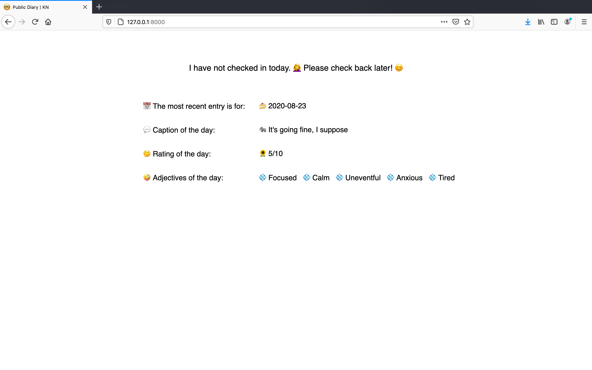

# Public Diary Web App

I figured it'd be neat to be able to update my friends and family by keeping a public diary of sorts that can be accessed anytime. I built the app by following (not too closely) [Django REST with React tutorial](https://www.valentinog.com/blog/drf/) and attempted to deploy to Heroku, but many things seemed to go wrong there (but mainly static files). I would very much like to get this up and running (to curb my mom's calls), so please reach out if you think you can help me!

Here is a picture of the app running locally:

It also shows the most recent entry if you haven't checked in that day:

